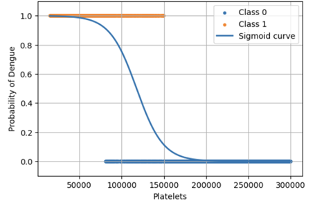

Logistic regression is a supervised machine learning algorithm used for binary classification problems, where the dependent variable has two possible outcomes. It models the relationship between one or more independent variables and a dichotomous dependent variable by estimating the probability that a given input belongs to a particular class.

### 1. Linear Combination
In logistic regression, the input features are combined linearly using weights and a bias term. This linear combination is expressed as:

<strong>z = w · x + b</strong>

where:
- **w** represents the weight vector.
- **x** represents the input features.
- **b** is the bias term.

### 2. The Sigmoid Function
The computed value **z** is then passed through a **sigmoid function**, which maps any real-valued number into a probability between 0 and 1. The sigmoid function is defined as:

    <strong>p = σ(z) = </strong>
    

        
1

        
1 + e-z

    

The figure below shows the sigmoid curve of logistic regression illustrating the probability of dengue classification with respect to platelet count, along with the distribution of the two classes.

    
     

### 3. Output and Prediction
The output **p** represents the probability that the input instance belongs to the positive class. Since the sigmoid function is symmetric around 0.5, a threshold value is applied to convert the probability into a class label during prediction. Typically, a threshold of 0.5 is used:

**Prediction:**
- **1** if **p ≥ 0.5**
- **0** if **p < 0.5**

Based on this thresholding process, the model assigns a class label to each input instance, thereby producing the final binary classification output.

### 4. Merits of Logistic regression:

•	Logistic regression provides easily interpretable model coefficients, helping to understand the relationship between input features and the predicted outcome.

•	It is computationally efficient, easy to implement, and performs well on large datasets with relatively low computational cost.

•	The model produces probability estimates between 0 and 1, allowing flexible decision-making through threshold adjustment.

### 5. Demerits of Logistic regression:

• Logistic regression assumes a linear relationship between the independent variables and the log-odds of the dependent variable, which may not hold for complex real-world data.

• It is sensitive to outliers and irrelevant features, which can negatively affect model performance.

• Logistic regression may underperform when the classes are not linearly separable or when the dataset has complex nonlinear patterns.
