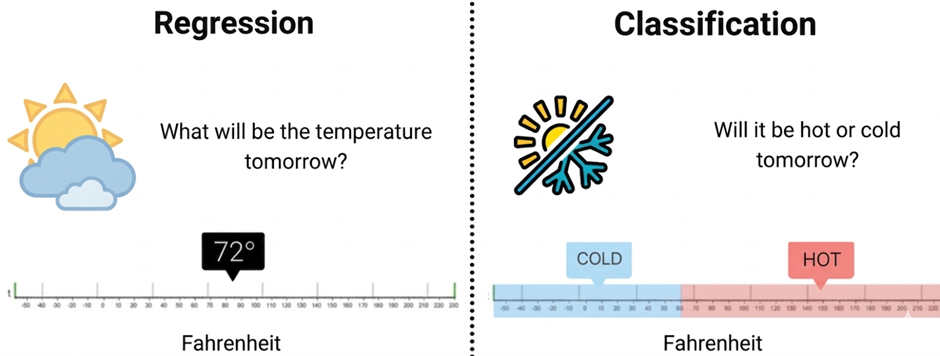
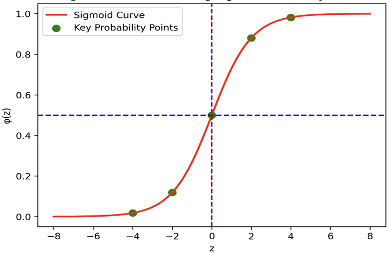
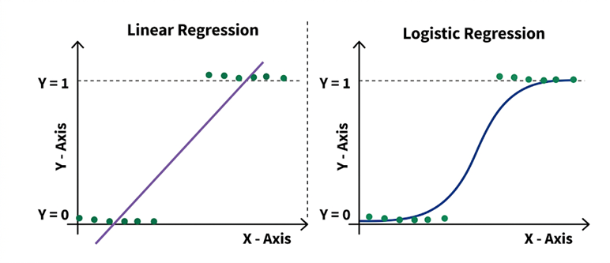

### 1. Classification vs. Regression
In supervised machine learning, models are trained using datasets in which each input sample is associated with a known target output. Depending on the nature of this target variable, supervised learning problems are broadly categorized into regression and classification tasks.

**Regression** involves predicting a continuous numerical value. For example, estimating the price of a house based on its area, location, and number of rooms is a regression problem. Algorithms such as linear regression are commonly used for this type of task.

**Classification** involves predicting a discrete class label or category. For instance, determining whether a patient has dengue (Yes/No) based on clinical symptoms and test results is a classification problem. Algorithms such as logistic regression are specifically designed for classification tasks.

Understanding the distinction between regression and classification is important because the choice of algorithm depends on the type of output variable being predicted.

Despite containing the word "regression" in its name, logistic regression is a classification algorithm. The name comes from the fact that it models the log-odds (a continuous quantity) as a linear function of the inputs, and then transforms this value into a probability using the logistic (sigmoid) function.

 
<strong>Figure 1: Conceptual Difference Between Regression and Classification in Machine Learning</strong>

The Figure 1 compares regression and classification tasks in machine learning using a temperature example. Regression predicts an exact numerical value (72°F), while classification predicts a category such as cold or hot based on a temperature range.

### 2. Introduction to Logistic Regression
Logistic Regression is a supervised machine learning algorithm used for classification problems, where the objective is to predict the probability that a given input belongs to a particular class. Unlike linear regression, which predicts continuous numerical values, logistic regression is designed to produce outputs that represent probabilities between 0 and 1. It achieves this by first computing a linear combination of the input features and then transforming this value using a nonlinear function so that the output can be interpreted as the likelihood of belonging to a specific class. Logistic regression is most commonly applied to binary classification tasks, such as determining whether an email is spam or not, whether a patient has a disease or not, or whether a transaction is fraudulent or legitimate. Due to its simplicity, interpretability, and ability to model class probabilities, logistic regression is widely used as a baseline classification method in many practical machine learning applications.

### 3. Linear Combination in Logistic Regression
In logistic regression, the model first computes a linear combination of the input features, exactly as in linear regression:

    
        <i>z</i> = <i>β</i>0 + <i>β</i>1<i>x</i>1 + <i>β</i>2<i>x</i>2 + ... + <i>βn</i><i>xn</i> = <b>w</b> · <b>x</b> + <i>b</i>
    

where:
- **x₁, x₂, ..., xₙ** are the input features (independent variables). In the dengue classification experiment, these include clinical attributes such as Age, Fever Days, Hematocrit, WBC count, and binary symptom indicators like Headache, Eye Pain, and Muscle Pain.
- **β₁, β₂, ..., βₙ** (equivalently **w**, the weight vector) are the model coefficients (parameters) that the algorithm learns during training. Each coefficient quantifies the contribution of its corresponding feature to the prediction.
- **β₀** (equivalently **b**, the bias or intercept term) allows the decision boundary to shift independently of the feature values. Without a bias, the model would be forced to pass through the origin in feature space.

The quantity **z** is called the **log-odds** or **logit** of the positive class, because as we shall see, it equals the logarithm of the ratio of the probability of the positive class to the probability of the negative class.

### 4. The Sigmoid (Logistic) Function
The computed value **z** can be any real number, ranging from -∞ to +∞. To convert it into a probability, logistic regression applies the **sigmoid function** (also called the logistic function):

    
        <i>p</i> = <i>σ</i>(<i>z</i>) = 
        

            
1

            
1 + <i>e</i>−<i>z</i>

        

    

 
<strong>Figure 2: Sigmoid Function Curve Showing Probability Transformation</strong>

The Figure 2 shows the sigmoid (logistic) function, which converts a linear input value into a probability between 0 and 1 in logistic regression. The S-shaped curve has a midpoint at z = 0 (probability = 0.5), which acts as the decision boundary for binary classification.

**Key properties of the sigmoid function:**
1. **Bounded output**: σ(z) always lies strictly between 0 and 1, so the output is directly interpretable as a probability.
2. **Monotonically increasing**: As z increases, σ(z) increases. This means that higher values of z correspond to higher probabilities of belonging to the positive class.
3. **Symmetric around z = 0**: σ(0) = 0.5, which provides a natural decision boundary. When z > 0, the probability exceeds 0.5 (predict positive); when z < 0, the probability is below 0.5 (predict negative).
4. **Smooth and differentiable**: The sigmoid has a continuous derivative at every point, which is essential for gradient-based optimisation. Its derivative has an elegant form:

    
        <i>σ</i>'(<i>z</i>) = <i>σ</i>(<i>z</i>) · (1 − <i>σ</i>(<i>z</i>))
    

5. **Asymptotic behaviour**: As z → +∞, σ(z) → 1; as z → -∞, σ(z) → 0. The function never actually reaches 0 or 1.

### 5. The Logit (Log-Odds) Interpretation
The inverse of the sigmoid function is called the **logit function**. If we denote the probability of the positive class as **p**, then:

    
        logit(<i>p</i>) = log
        (
        

            
<i>p</i>

            
1 − <i>p</i>

        

        )
        = <i>z</i> = <b>w</b> · <b>x</b> + <i>b</i>
    

The quantity **p/(1 - p)** is known as the **odds** — the ratio of the probability of the event occurring to the probability of it not occurring. The logit is the natural logarithm of the odds. For example, if p = 0.8, the odds are 0.8/0.2 = 4 (i.e., the event is 4 times more likely to occur than not), and the logit is log(4) ≈ 1.386.

In logistic regression, the logit is modelled as a linear function of the features. This means that each unit increase in a feature **xⱼ** changes the log-odds by **βⱼ**, or equivalently, multiplies the odds by **eβⱼ**. This property makes logistic regression coefficients directly interpretable: a positive coefficient increases the odds of the positive class, while a negative coefficient decreases them.

### 6. Output and Prediction
The output **p** represents the probability that the input instance belongs to the positive class (e.g., dengue-positive). To convert this probability into a class label, a **decision threshold** is applied:

**Prediction:**
- **Class 1 (Positive)** if **p ≥ threshold**
- **Class 0 (Negative)** if **p < threshold**

The default threshold is **0.5** because it corresponds to the symmetry point of the sigmoid (σ(0) = 0.5) and treats both classes equally. However, in practice, the threshold can be adjusted based on the application:
- In medical diagnosis (such as dengue detection), a **lower threshold** (e.g., 0.3) may be chosen to increase sensitivity (recall), ensuring that fewer positive cases are missed, even at the cost of more false alarms.
- In spam detection, a **higher threshold** (e.g., 0.7) may be preferred to increase precision, ensuring that legitimate emails are not incorrectly classified as spam.

### 7. Linear vs Logistic Regression

| Aspect | Linear Regression | Logistic Regression |
| :--- | :--- | :--- |
| **Purpose** | Used to predict continuous numerical values | Used to predict categorical outcomes (usually binary) |
| **Type of Problem** | Regression | Classification |
| **Output** | Continuous numeric value | Probability between 0 and 1, then converted to class label |
| **Example** | Predict house price from area | Predict whether a patient has dengue (Yes/No) |
| **Mathematical Model** | <i>y</i> = <b>w</b> · <b>x</b> + <i>b</i> | <i>p</i> = 

1

1 + <i>e</i>−(<b>w</b> · <b>x</b> + <i>b</i>)

 |
| **Activation Function** | No activation function | Sigmoid (logistic) function |
| **Output Range** | −∞ to +∞ | 0 to 1 |
| **Decision Boundary** | Not required | Uses threshold (usually 0.5) |
| **Loss Function** | Mean Squared Error (MSE) | Binary Cross-Entropy (Log Loss) |
| **Interpretation** | Predicts exact numeric value | Predicts probability of belonging to a class |
| **Evaluation Metrics** | MSE, RMSE, R² | Accuracy, Precision, Recall, F1-Score, ROC-AUC |
| **Graph Shape** | Straight line | S-shaped sigmoid curve |
| **Applications** | House price prediction, stock prediction | Disease detection, spam detection, fraud detection |

 
<strong>Figure 3: Comparison of Linear Regression and Logistic Regression Decision Behavior</strong>

The Figure 3 compares linear regression and logistic regression models for binary outcomes. Linear regression fits a straight line that can produce values beyond 0 and 1, while logistic regression uses a sigmoid curve to constrain predictions between 0 and 1 for classification.

### 8. Loss Function (Binary Cross-Entropy)
Logistic regression uses the **binary cross-entropy** loss function (also called log loss), which is derived from the principle of maximum likelihood estimation:

    
        <i>L</i> = −
        

            
1

            
<i>N</i>

        

        Σ [<i>yi</i> · log(<i>pi</i>) + (1 − <i>yi</i>) · log(1 − <i>pi</i>)]
    

where:
- **N** is the number of training samples
- **yᵢ** is the actual label (0 or 1) of the i-th sample
- **pᵢ** is the predicted probability for the i-th sample

**Understanding the loss function intuitively:**
- When **yᵢ = 1** (actual positive), the loss for that sample is **−log(pᵢ)**. If the model predicts p close to 1, −log(1) ≈ 0 (low loss). If it predicts p close to 0, −log(0) → ∞ (very high loss, strong penalty).
- When **yᵢ = 0** (actual negative), the loss is **−log(1 − pᵢ)**. If the model predicts p close to 0, the loss is low. If it predicts p close to 1, the loss is very high.

This loss function is **convex**, guaranteeing that gradient descent will converge to the global minimum.

### 9. Gradient Descent
The model parameters (weights and bias) are updated iteratively using **gradient descent**:

    
        <i>βj</i> = <i>βj</i> − <i>α</i> · 
        

            
∂<i>L</i>

            
∂<i>βj</i>

        

    

where **α** is the learning rate (a hyperparameter controlling the step size). The gradient of the log loss with respect to each weight is:

    
        

            
∂<i>L</i>

            
∂<i>βj</i>

        

        = 
        

            
1

            
<i>N</i>

        

        Σ (<i>pi</i> − <i>yi</i>) · <i>xij</i>
    

This gradient has a clean and intuitive form: it is the average of the prediction error **(pᵢ - yᵢ)** weighted by the feature value **xᵢⱼ**. The weights are adjusted in the direction that reduces the prediction error.

### 10. Regularization
When the number of features is large or the features are correlated, the learned weights can become very large, causing the model to overfit the training data. Regularization combats this by adding a penalty term to the loss function that discourages large weight values.

**L1 Regularization (Lasso)**

    
        <i>L</i>regularized = <i>L</i> + <i>λ</i> · Σ |<i>βj</i>|
    

L1 regularization adds the sum of absolute weights. It can drive some coefficients exactly to zero, effectively performing feature selection.

**L2 Regularization (Ridge)**

    
        <i>L</i>regularized = <i>L</i> + <i>λ</i> · Σ <i>βj</i>2
    

L2 regularization adds the sum of squared weights to the loss. It shrinks all coefficients toward zero but does not set any coefficient exactly to zero. In scikit-learn, the regularization strength is controlled by the parameter **C = 1/λ**: a smaller C means stronger regularization.

### 11. Training Algorithm
**Step 1: Initialise Parameters**
- Set all weights β₁, β₂, ..., βₙ and bias β₀ to small random values or zeros.

**Step 2: Compute the Linear Combination**
- For each training example, calculate:

    
        <i>z</i> = <i>β</i>0 + <i>β</i>1<i>x</i>1 + <i>β</i>2<i>x</i>2 + ... + <i>βn</i><i>xn</i>
    

**Step 3: Apply the Sigmoid Function**
- Compute the predicted probability:

    
        <i>p</i> = 
        

            
1

            
1 + <i>e</i>−<i>z</i>

        

    

- The result is always between 0 and 1.

**Step 4: Compute the Loss**
- Calculate the binary cross-entropy loss over all training examples:

    
        <i>L</i> = −
        

            
1

            
<i>N</i>

        

        Σ [<i>yi</i> · log(<i>pi</i>) + (1 − <i>yi</i>) · log(1 − <i>pi</i>)]
    

**Step 5: Compute the Gradient**
- For each weight: 

    
        

            
∂<i>L</i>

            
∂<i>βj</i>

        

        = 
        

            
1

            
<i>N</i>

        

        Σ (<i>pi</i> − <i>yi</i>) · <i>xij</i>
    

- For the bias:

    
        

            
∂<i>L</i>

            
∂<i>β</i>0

        

        = 
        

            
1

            
<i>N</i>

        

        Σ (<i>pi</i> − <i>yi</i>)
    

**Step 6: Update Parameters**

    
        <i>βj</i> = <i>βj</i> − <i>α</i> · 
        

            
∂<i>L</i>

            
∂<i>βj</i>

        

        (for all <i>j</i>)
    

- α is the learning rate hyperparameter.

**Step 7: Repeat Until Convergence**
- Repeat Steps 2–6 until the change in loss between successive iterations falls below a tolerance threshold, or a maximum number of iterations is reached.

**Step 8: Prediction**
- For a new input, calculate **p** using the learned weights.
- Apply the decision threshold (default 0.5):
  - If **p ≥ 0.5**, predict **Class 1**
  - If **p < 0.5**, predict **Class 0**

### 12. Evaluation Metrics for Binary Classification
After training the model, its performance must be evaluated on unseen test data. Several metrics are used, each capturing a different aspect of classification quality.

#### 12.1 Confusion Matrix
The confusion matrix is a 2 × 2 table that summarises the four possible outcomes of binary classification:

| | Predicted Positive | Predicted Negative |
| :--- | :--- | :--- |
| **Actual Positive** | True Positive (TP) | False Negative (FN) |
| **Actual Negative** | False Positive (FP) | True Negative (TN) |

- **True Positive (TP)**: The model correctly predicts the positive class.
- **True Negative (TN)**: The model correctly predicts the negative class.
- **False Positive (FP)**: The model incorrectly predicts the positive class when the actual class is negative (Type I error).
- **False Negative (FN)**: The model incorrectly predicts the negative class when the actual class is positive (Type II error).

#### 12.2 Accuracy

    
        Accuracy = 
        

            
TP + TN

            
TP + TN + FP + FN

        

    

Accuracy measures the overall proportion of correct predictions. It is useful when classes are balanced but can be misleading for imbalanced datasets.

#### 12.3 Precision

    
        Precision = 
        

            
TP

            
TP + FP

        

    

Precision measures the proportion of predicted positive instances that are actually positive. A high precision value indicates that the model produces fewer false positive predictions.

#### 12.4 Recall (Sensitivity)

    
        Recall = 
        

            
TP

            
TP + FN

        

    

Recall measures the proportion of actual positive instances that are correctly identified by the model. A high recall value indicates that the model successfully detects most of the positive cases and produces fewer false negatives.

#### 12.5 F1-Score

    
        F1 = 2 × 
        

            
Precision × Recall

            
Precision + Recall

        

        = 
        

            
2TP

            
2TP + FP + FN

        

    

The F1-Score is the harmonic mean of precision and recall. It provides a single metric that balances both concerns and is particularly useful when the class distribution is uneven.

#### 12.6 Specificity

    
        Specificity = 
        

            
TN

            
TN + FP

        

    

Specificity measures the proportion of actual negatives that are correctly identified. It is the complement of the false positive rate.

#### 12.7 ROC Curve and AUC
The **Receiver Operating Characteristic (ROC)** curve plots the True Positive Rate (Recall) against the False Positive Rate (1 - Specificity) at various threshold settings. A model that perfectly separates the two classes produces a curve that passes through the top-left corner (TPR = 1, FPR = 0).

The **Area Under the ROC Curve (AUC)** summarises the overall discriminative ability of the model into a single number:
- **AUC = 1.0**: Perfect classifier
- **AUC = 0.5**: No better than random guessing
- **AUC < 0.5**: Worse than random (labels may be inverted)

In this experiment, the model achieved an AUC of 0.998, indicating near-perfect separation between the two classes.

### 13. Merits of Logistic Regression
- **Interpretability**: Each coefficient directly quantifies the effect of its feature on the log-odds of the positive class, making the model easy to explain to domain experts and stakeholders.
- **Computational efficiency**: Training requires only convex optimisation, which converges reliably even on large datasets. The algorithm has no expensive operations like matrix inversion of the full feature space.
- **Probabilistic output**: Unlike algorithms that output only class labels, logistic regression provides calibrated probability estimates, enabling flexible threshold tuning for different application requirements.
- **Low risk of overfitting**: With appropriate regularization, logistic regression generalises well even with moderate amounts of training data.
- **Strong baseline**: In practice, logistic regression frequently matches or exceeds the performance of more complex models on linearly separable or moderately nonlinear problems, making it an essential first model to try.

### 14. Demerits of Logistic Regression
- **Linear decision boundary**: Logistic regression assumes that the log-odds of the outcome are a linear function of the features. It cannot capture complex nonlinear relationships unless feature engineering (e.g., polynomial features, interaction terms) is applied manually.
- **Sensitivity to outliers**: Extreme values in the feature space can disproportionately influence the learned coefficients and shift the decision boundary.
- **Multicollinearity issues**: When input features are highly correlated, the coefficient estimates become unstable and difficult to interpret, even though the overall predictions may remain reasonable.
- **Not suitable for multi-modal class distributions**: When the positive and negative classes form complex, non-convex regions in feature space, logistic regression will underperform compared to tree-based or kernel-based methods.

